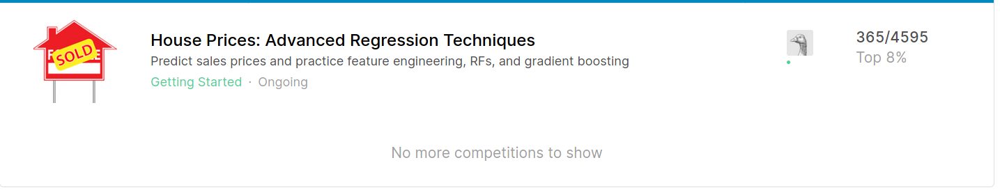
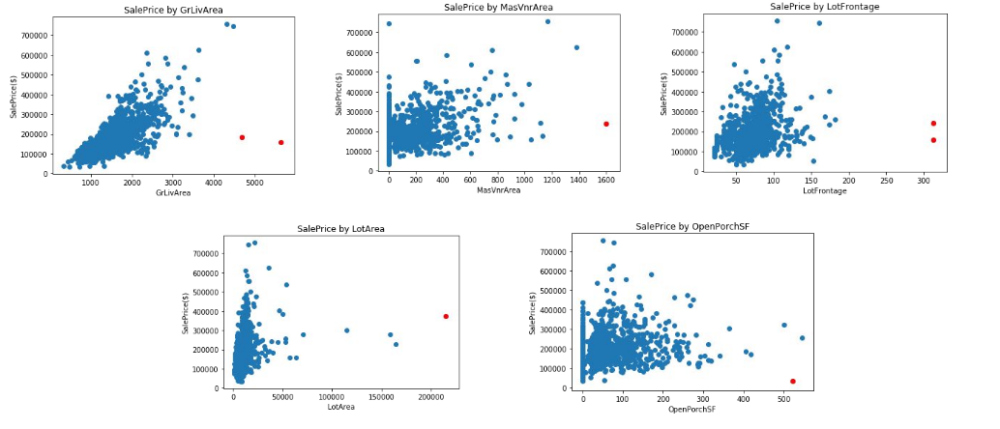
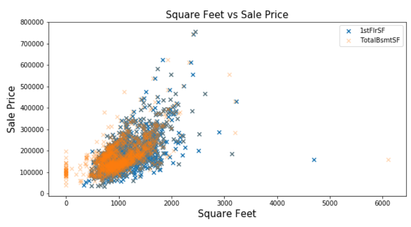
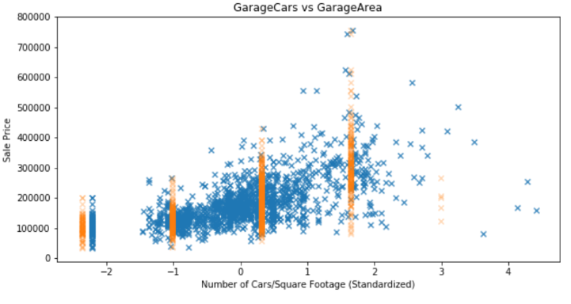
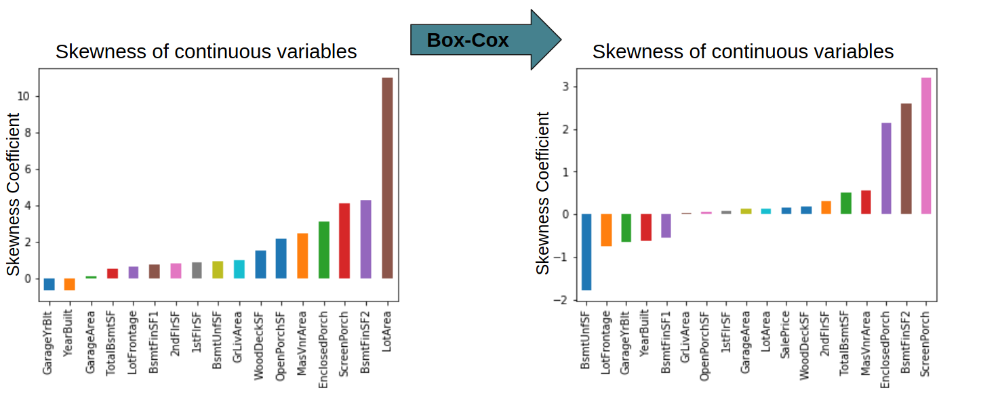
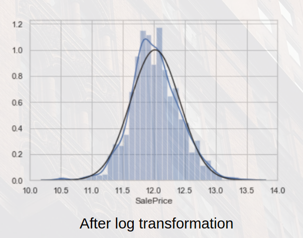
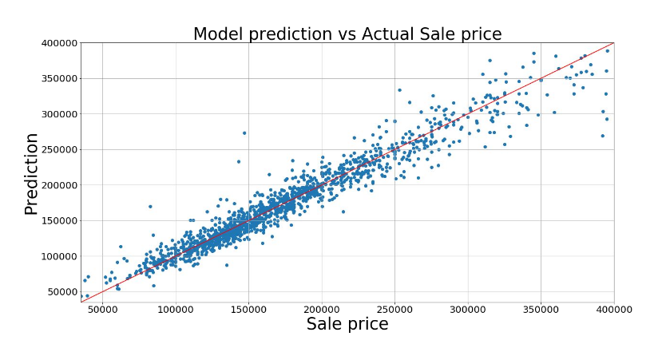

# House Prices: Advanced Regression Techniques (Top 8%)

## Removing Outliers

There are significant outliers in this data set. Identifying and removing such data points can have a great impact on the residual error your model.

## Feature Selection: Multicollinearity

Variance Inflation Factor can detect Multicollinearity.

where  is the from a regression of an input vector  from all of the other features. If  is close to 1, then collinearity is present, and so the VIF will be large.

Preforming this calculation found significant collinearity with 1StFlrSF all other features with a VIF > 30. This is consistent with the intuition that the first floor is going to be equal in size the the square footage of the basement and second floor.

Also GarageAre proved to had

Removing these features showed a significant increase in score.

## Dealing with Skewness

We used used the followin calculates the coefficient of skewness:

where  is tthe cetral moment. Negative skew usually  indicates that the tail is on the left side of the distribution, and positive skew indicates that the tail is on the right. For normally distributed data, the skewness should be about 0. Applying a one parameter box cox transformation to the skewed variable that have a skewness of s such that 2 < s < -2.

Making this transformation with helped us  achieve symmetry, and normality of our variables. It will also help us stabilize the variance of the distributions and improve the validity of association measures (e.g. correlation).

## Natural Log Transformation of Sale Price

## Prediction

